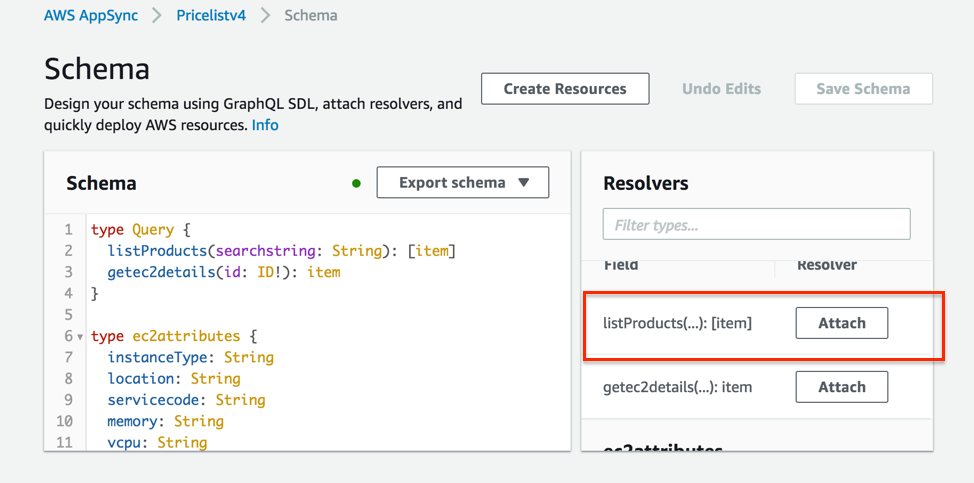

## [Ask Jeeves](https://en.wikipedia.org/wiki/Jeeves): Backend integration of mobile applications using AWS AppSync

| Step | Description   |
| -----|---------------|
| 1.   | [Generate Cloud9 SSH Key](#cloud9-ssh-key) |
| 2.   | [Setup EC2, Cloud9, Elasticsearch, ...](#run-cfn) |
| 3.   | [Install Expo mobile client](#install-expo)
| 4.   | [QR code friendly Cloud9 theme](#customize-cloud9)|
| 5.   | [Mobile application and Cognito authentication](#clone-mobile-code)
| 6.   | [AppSync Schema ](#appsync-schema)|
| 7.   | [Integration and testing ](#integration)|

<a name="cloud9-ssh-key"></a>
##  I. Generate Cloud9 SSH Key

1.	Login to AWS console and make sure to select Singapore (`ap-southeast-1`) region. You need to be in **Singapore** region for this lab. 
2.	Go to EC2 page and create a new key pair if not already exists and download the key to your machine.
3.	Open AWS Cloud9 services page.
4. Click on **Create Environment**.
  

5. Give any appropriate name and description to your environment. Click on **Next**.
6. In the next page, select the option **Connect and run in remote server (SSH)**. Scroll down and expand View Public SSH key. Click **Copy key to clip board**. Once you have copied the key, please leave this screen intact. We will come back once the EC2 creation completed. 


<a name="run-cfn"></a>
##  II. Development Stack creation
1. Open a new browser tab and instantiate this CloudFormation template: 
<a href="https://console.aws.amazon.com/cloudformation/home?region=ap-southeast-1#/stacks/new?templateURL=https://s3-ap-southeast-1.amazonaws.com/techsummit2018appsync/prereqscfn.json" target="_blank">
  
</a>


2. Click on **Next**. 


3. Please provide below inputs
	* Stack Name :  cloud9env (any name as you prefer)
	* Cloud9Key : Paste the key you have copied in the step 6, previously.
	* InstanceType : You can leave the default (c4.xlarge)
	* KeyName : Please select the existing key in this region(Singapore). If not, please create one 
	* SSHLocation : We can leave as the default value.
	
    <br/>
    Click on **Next**.
4. Leave the defaults as-is on this screen, click **Next**.
5. In Next screen, Select the checkbox for `I acknowledge that cloudformation might create IAM resouces` in the bottom and Click **Create**.
6. Once the stack creation completes, Go to Outputs and copy the IP address as below
    
7. Go to the cloud9 screen/tab when we left in the step 6 and fill the below details and then click next step.
    * User : ec2-user
    * Host : Paste the IP address copied from the cloudformation stack
    * Port : 22
    * Advanced settings. Environment path – give any pathname (without spaces)
    

8. Click **Create environment** and wait for it to complete.<br/>
    
     
9. In the below screen, uncheck the “c9.ide.lambda.docker”. Click **Next**.<br/>
    
    
10. In the next screen, click cancel the installation and click Finish. We do not need lambda related stuffs for now<br/>
    
11. Click **Finish** in the below screen<br/>
	
12. Your cloud9 environment is ready<br/>
    

<a name="install-expo"></a>
## III. Install Expo mobile client

To participate with your mobile you need to have the Expo Client installed (Android or iOS).<br/>
* **ANDROID CLIENT:**<br/>
    https://play.google.com/store/apps/details?id=host.exp.exponent <br/>
* **IOS CLIENT:**<br/>
    https://itunes.com/apps/exponent <br/>


<a name="customize-cloud9"></a>
## IV. QR Code friendly Cloud9 theme

1. Go to the newly cloud9 environment and click the settings, select THEMES(top right corner near cloud9 symbol). Select one of the Classic theme and night based color ( this is needed for the QR code to be visible for the expo client).<br/>

2. Once the theme got changed, open terminal window. The current working directory will be whatever the environment name you have given during the cloud9 create environment steps.<br/>
3. Open a shell/terminal and run command `create-react-native-app Test`.<br/>


4. Once the creation is success, you will see the final confirmation as below. Also, in your cloud9 IDE, you will see the project folder “Test”.<br/>

5. `cd Test; npm start`<br/>


6. Now, from your mobile, open the expo app.<br/>
7. Scan the QR code on the expo app and you will see the application loading in your mobile.<br/>
8. You can edit the file `App.js` and once saved, you will see the application in your mobile auto load the changes.<br/>


<a name="clone-mobile-code"></a>
## V. Mobile application and Cognito Authentication.

1. `git clone https://github.com/arunmbalaji/ask-jeeves.git`
2. cd to the project directory "ask-jeeves". 
3. `npm install; npm start`. 
4. We can then install some dependencies:

>npm install -g awsmobile-cli

5. Set up an IAM user.  YouTube - Configuring the AWSMobile CLI
https://www.youtube.com/watch?v=MpugaNKtw3k

6. Now configure awsmobile to use our IAM role:

>awsmobile configure

Enter Access Key, Secret Access Key and region (ap-southeast-1)

>awsmobile init

Default answers should be fine:

>Please tell us about your project:
>* Where is your project's source directory:  /
>* Where is your project's distribution directory that stores build artifacts:  /
>* What is your project's build command:  npm.cmd run-script build
>* What is your project's start command for local test run:  npm.cmd run-script start
>* What awsmobile project name would you like to use:  ask-jeeves-2018-08-12-12-11-54

>Successfully created AWS Mobile Hub project: workshop-2018-08-12-12-11-54
>This installed a bunch of dependencies for us:
>info Direct dependencies[...]


There will be a lot of additional info and then at the end you should see something like:
```
Success! your project is now initialized with awsmobilejs
 
   awsmobilejs\.awsmobile
     is the workspace of awsmobile-cli, please do not modify its contents
 
   awsmobilejs\#current-backend-info
      contains information of the backend awsmobile project from the last
      synchronization with the cloud

   awsmobilejs\backend
     is where you develop the codebase of the backend awsmobile project

   awsmobile console
     opens the web console of the backend awsmobile project

   awsmobile run
     pushes the latest development of the backend awsmobile project to the cloud,
     and runs the frontend application locally

   awsmobile publish
     pushes the latest development of the backend awsmobile project to the cloud,
     and publishes the frontend application to aws S3 for hosting

Happy coding with awsmobile!
```

This will have created some backend resources including some S3 buckets.  You should now see your project in the AWS Mobile Hub console.

### Add Authentication.
>**awsmobile user-signin enable -p**

> * Sign-in is currently disabled, what do you want to do next Go to advanced settings
> * Which sign-in method you want to configure Cognito UserPools (currently disabled)
> * How are users going to login Username
> * Password minimum length (number of characters) 6
> * Password character requirements lowercase, numbers

>**awsmobile push**
This will have created a new Cognito user pool that you can view in the AWS console.  This is used to manage logins to our App.  

Next, let us create a new Cognito user.
* Go to Cognito service in the AWS console and select `Manage Userpools`.
* Select the userpool we created via awsmobile. 
* Select **users and groups** and create a new user.

Now it's simple to add authentication:

In App.js, below the React Native imports let’s import the withAuthenticator HOC (Higher Order Component):
```
import { withAuthenticator } from 'aws-amplify-react-native';
import Amplify from 'aws-amplify';
import aws_exports from './aws-exports';
Amplify.configure(aws_exports);
```
Next, instead of having the default export on the App class we’ll use the HOC as the default export:
```
class App extends React.Component {  // Remove export default from here
  // all of this code stays the same
}

// Add this line after the App definition
export default withAuthenticator(App);
```

Save your changes.  If you are still running the App it should update automatically. 


<a name="appsync-schema"></a>
## VI. AppSync Schema

1. In your AWS console, go to AppSync service.
2. Click **Create API**. Select `Author from scratch`. 
3. Enter name of the API as: `TechSummit-AppSync-Workshop` and **Create**.
4. Next, let's set up the AppSync data sources. Select `Data sources` on the left side.<br/>
<br/>
5. After the data source is created, you will see:<br/>
<br/>

6. Now, lets set up AppSync integration with Cognito for authentication. AppSync => Settings => Select `Cognito user pools`. <br/>
<br/>

7. Select the `Cognito user pool created via awsmobile-cli`.<br/>


8. Enable AppSync logging.


9. Save the settings.

10. Select 'Schema' on the left-hand panel.
11. Paste the following code in the Schema console.
```
type Query {
  listProducts(searchstring: String): [item]
  getec2details(id: ID!): item
}

type ec2attributes {
  instanceType: String
  location: String
  servicecode: String
  memory: String
  vcpu: String
  tenancy: String
  operatingSystem: String
  preInstalledSw: String
}

type item {
  id: ID!
  attributes: ec2attributes
  ondemand: pricing
  reserved3year: pricing
}

type pricing {
  term: String
  hourlyrate: String
  monthlyrate: String
  yearlyrate: String
  upfrontfee: String
}

schema {
  query: Query
}
```
12. Save schema.
13. Attach `Resolvers` to `listProducts` query.<br/>
<br/>
click **Attach**.
14. Add the request and response templates. <br/>
<br/>
15. Request mapping template:
```
#** 
  The 'params' key accepts any valid Elasticsearch DSL expression. 
  You must replace the <index>, <type>, and <field> placeholders with actual values. 
*#
{
#if($util.isNullOrEmpty(${context.args.searchstring}))
  #set($sear="*")
#else 
  #set($sear=${context.args.searchstring})
#end
    "version":"2017-02-28",
    "operation":"GET",
    "path":"/amazonec2_new/_search",
    "params":{
      "body": {
            "from": 0,
            "size": 20,
        "_source": [  "product.attributes.instanceType",
                    "product.attributes.operatingSystem",
                            "product.attributes.vcpu",
                            "product.attributes.memory",
                            "product.attributes.location",
                            "product.attributes.tenancy",
                            "product.attributes.preInstalledSw",
                            "product.attributes.servicecode",
                            "terms.OnDemand"
                        ],
        "query": {
            "query_string" : {
              "fields" : ["product.attributes.vcpu",
                      "product.attributes.memory",
                            "product.attributes.location",
                            "product.attributes.tenancy",
              "product.attributes.operatingSystem",
                            "product.attributes.preInstalledSw",
                            "product.attributes.instanceType"
                            ],
              "query" : "${sear}"
          }
      }

      }
    }
}
```

Response mapping template:
```
#** 
  $context.result contains the full response of the Elasticsearch query.
  Select a subset of information or iterate through hits to return the
  same shape as is expected by this field.
*#
[
    #foreach($entry in $context.result.hits.hits) 
        ## $velocityCount starts at 1 and increments with the #foreach loop **
        #if( $velocityCount > 1 ) , #end
        #set( $myMap = {
        "id": $entry.get('_id'),
          "attributes": {
            "instanceType": $entry.get('_source').product.attributes.instanceType,
            "location": $entry.get('_source').product.attributes.location,
            "servicecode": $entry.get('_source').product.attributes.servicecode,
            "memory": $entry.get('_source').product.attributes.memory,
            "vcpu": $entry.get('_source').product.attributes.vcpu,
            "operatingSystem": $entry.get('_source').product.attributes.operatingSystem,
            "tenancy": $entry.get('_source').product.attributes.tenancy,
            "preInstalledSw": $entry.get('_source').product.attributes.preInstalledSw
          },
          "ondemand": {
            "term": $entry.get('_source').terms.OnDemand[0].priceDimensions[0].description,
            "hourlyrate": $entry.get('_source').terms.OnDemand[0].priceDimensions[0].pricePerUnit.USD
          }
        })
  $util.toJson($myMap)      
    #end
]

```

16. Before, we execute the AppSync query, we need to authenticate the user (via the cognito pool). Select `Query` in the AppSync panel and hit **Login with Userpools**.<br/>
17. Get the Cognito App client id.
<br/>
18. In the AppSync query panel, login using any cognito user.
<br/>
19. Once successfully logged-in, execute the following query:
```
query testquery {
  listProducts(searchstring: "Mumbai") {
    id
      attributes {
        instanceType
        vcpu
        memory
      }
      ondemand {
        term
        hourlyrate
      }

  } 
}
```

<a name="integration"></a>
## VII. Integrate mobile application with AppSync.
1. Open the Cloud9 IDE.
3. Edit `App.js`
